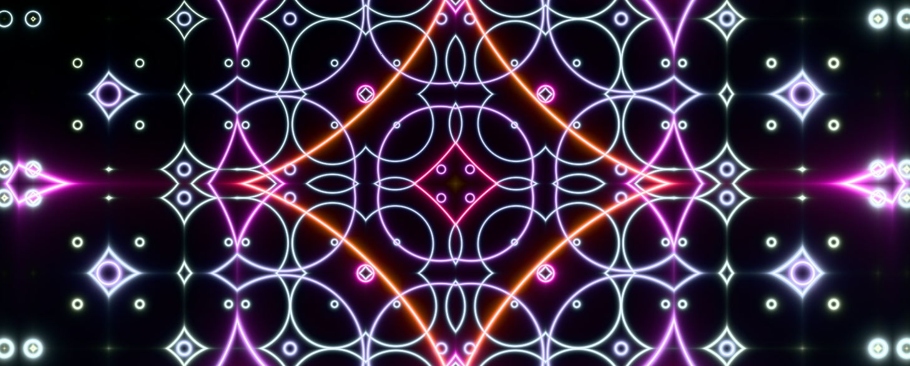

A demo using the new [Three.js Shading Language](https://github.com/mrdoob/three.js/wiki/Three.js-Shading-Language) to create a procedural shader effect like the one shown in this YouTube video [An introduction to shader art coding](https://www.youtube.com/watch?v=f4s1h2YETNY)

